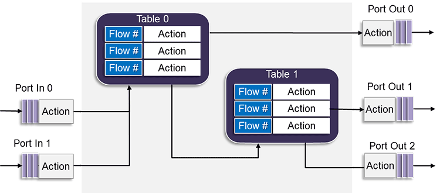

# DPDK Packet Framework for Stateful Firewall

## Talk about your understanding of this framework, at high level

In the context of DPDK data plane application(s), packet processing on the one hand should traverse through the same fast path as RX and TX, on the other hand should distribute workloads across applicaton contexts.  In order to achieve very high packet processing throughput with 10G/40G/100G NICs, packet processing is likely distributed in pipelines of stages that include RX prots, TX ports, and tables of actions on packets.  By so doing, the packet framework not only allows a data plane application to scale up to the throughput requirements, but also allows the application architecture to adapt or extend by using a standard methodology with reusable building blocks.  One balancing act is implement such a framework that also meets latency requirements, among other considerations.

DPDK Packet Framework allows custom configurations of pipelines by using configuration file.

### Illustration of Primitive Building Blocks of Packet Framework Pipelines

### Illustration of Pipeline Configuration File of L3 Forwarding

### Illustration of Pipeline Topology of Packet Framework Application

## How would you develop a data plane application based on this framework? Please have a diagram for the stateful firewall pipeline based on this framework

Statefule firewall implements connection tracking of packet flows on top of ACL.  It involves some packet inspection above Layer 4.

### Linux Firewall

### DPDK Firewall

## What could be the potential performance issue if we develop a complex pipeline based on this framework which has to support millions IP flows? How to enhance it

Generally in a firewall use case, the more (complex) rules the less throughput, everything else being equal.  The primary design goal is to meet the system throughput requirements while mitigating the latency constraints.

Theoretically in a pipeline architecture, the longer pipeline on a larger compute platform the higher throughput.  But as a pipeline gets longer, it is likely that its packet latency increases.

Therefore, without existing performance measurements on given platforms, a PoC may be needed to verify prliminary design with latency and throughput metrics.  This is usually a development step as DPDK performance tuning.

## Talk about the hardware offloading for this framework

As I do not have development experience in hardware offloading of firewall application in DPDK, I need further research in order to provide sensible answers.
